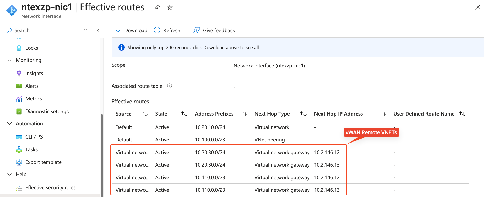

## Introduction 

This blog post shares an engineering validated pattern for establishing connectivity between Azure Extended Zones and Azure Virtual WAN environments. Currently, Virtual WAN hubs cannot be deployed within Extended Zones, so we need alternative approaches to bridge these environments.

Below is a summary of connectivity options between Extended Zones and Azure regions:

## Connectivity Options for Extended Zone to Azure Region

| Connectivity Method | Hub-Spoke Environment | Virtual WAN Environment |
|-------------------|---------------------|----------------------|
| **Global VNET Peering** | **Recommended option** for connecting Hub-Spoke network hubs | Not supported when hosting a gateway in Extended Zone VNET |
| **SD-WAN Network Virtual Appliance** | Establish connectivity using SD-WAN tunnels | Establish connectivity using SD-WAN tunnels |
| **ExpressRoute** | Not recommended due to added latency and bandwidth constraints | **Recommended option** given current lack of Virtual WAN hub support in Extended Zones |

For this implementation, we'll use ExpressRoute to connect the Extended Zone environment to other Azure regions.

## Configuration 

This setup follows the same configuration pattern used for establishing coexistence between Hub-Spoke environments and Virtual WAN. The key requirement is enabling bidirectional traffic flow between the two gateway types.

**Essential Configuration Settings:**

- **Hub-Spoke ExpressRoute Gateway**: Enable "Allow traffic from remote Virtual WAN networks"
- **Virtual WAN ExpressRoute Gateway**: Enable "Allow traffic from non Virtual WAN networks"

Below is my ExpressRoute Gateway deployed to Extended Zone VNET. 

Below configuration enables ExpressRoute Gateway to recieve routes from Virtual WAN ExpressRoute Gateway

## Validating Connectivity 

### Step 1: Verify Extended Zone VM Routes

First, validate that VMs in the Extended Zone are learning routes from the Virtual WAN environment through the ExpressRoute Gateway.

Effective routes from my VM in Perth Extended Zone shows routes learned from ExpressRoute Gateway and these are remote routes from my Virtual WAN environment.

### Step 2: Validate Virtual WAN Environment Routes 

Next, verify that VMs connected to the Virtual WAN hub are learning Extended Zone VNET prefixes.

Below routes are learned by my virtual machine connected to Virtual WAN hub that is hosting ExpressRoute Gateway and we are able to see Extended Zone VNET prefixes are learned by the network interface attached to my VM.

### Step 3: Check Virtual WAN Hub Effective Routes

For deeper insight into routing behavior, examine the effective routes from the Virtual WAN Hub. This view helps understand:
- AS Path information
- All prefixes learned by the ExpressRoute Gateway
- Route propagation between environments
  

### Additional Considerations 

**Bandwidth Constraints**: ExpressRoute Gateway bandwidth is limited by the gateway SKU configuration

**Additional Latency**: The gateway hop introduces extra latency to traffic flows between environments


## Conclusion 

If you are already using Virtual WAN network deployment, you can now take full advantage of Extended Zones by connecting to your existing Virtual WAN environment using your current ExpressRoute connectivity.