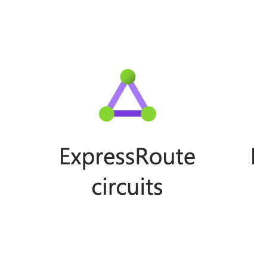

# BGP Authentication with MD5 Hash

## What is BGP MD5 Authentication?

BGP MD5 authentication is a security mechanism where BGP peers use a shared secret key to authenticate their communications. When enabled, each BGP message includes an MD5 hash calculated from the message content plus the shared key. The receiving peer calculates the same hash and compares it to verify the message came from an authenticated source.

## How MD5 Hash Works

MD5 (Message Digest 5) is a cryptographic hash function that takes input data of any size and produces a fixed 128-bit (16-byte) hash value, typically represented as a 32-character hexadecimal string. Key properties:

- **Deterministic**: Same input always produces the same hash
- **Fast computation**: Quick to calculate
- **Avalanche effect**: Small input changes create drastically different outputs
- **Fixed output size**: Always 128 bits regardless of input size

For BGP authentication, the hash is calculated over the BGP message plus the shared key, creating a unique fingerprint that proves the sender knows the secret.

## Benefits of Using MD5 Authentication

1. **Peer Authentication**: Prevents unauthorized routers from establishing BGP sessions with your router
2. **Message Integrity**: Detects if BGP messages have been tampered with during transmission
3. **Protection Against Injection**: Stops attackers from injecting malicious route advertisements
4. **Session Hijacking Prevention**: Makes it extremely difficult for attackers to take over established BGP sessions
5. **Compliance**: Many enterprise and service provider networks require authentication for security policies

## Without MD5 Authentication

When you don't use a shared key:

- **No Authentication**: Any router that knows your IP address and AS number can potentially establish a BGP session
- **No Message Integrity**: Corrupted or modified messages might be accepted
- **Vulnerability to Attacks**: Susceptible to BGP hijacking, route injection, and man-in-the-middle attacks
- **Easier Misconfigurations**: Accidental peering with wrong neighbors is more likely to succeed undetected

## Important Security Note

While MD5 was widely used historically, it's now considered cryptographically weak due to known collision vulnerabilities. Modern implementations should prefer stronger alternatives like SHA-256 or TCP Authentication Option (TCP-AO) where supported. However, MD5 authentication still provides significant security benefits over no authentication at all, especially in controlled environments like ExpressRoute where the physical infrastructure is managed by the service provider.

