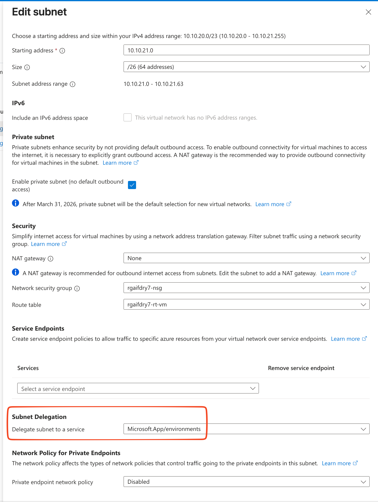
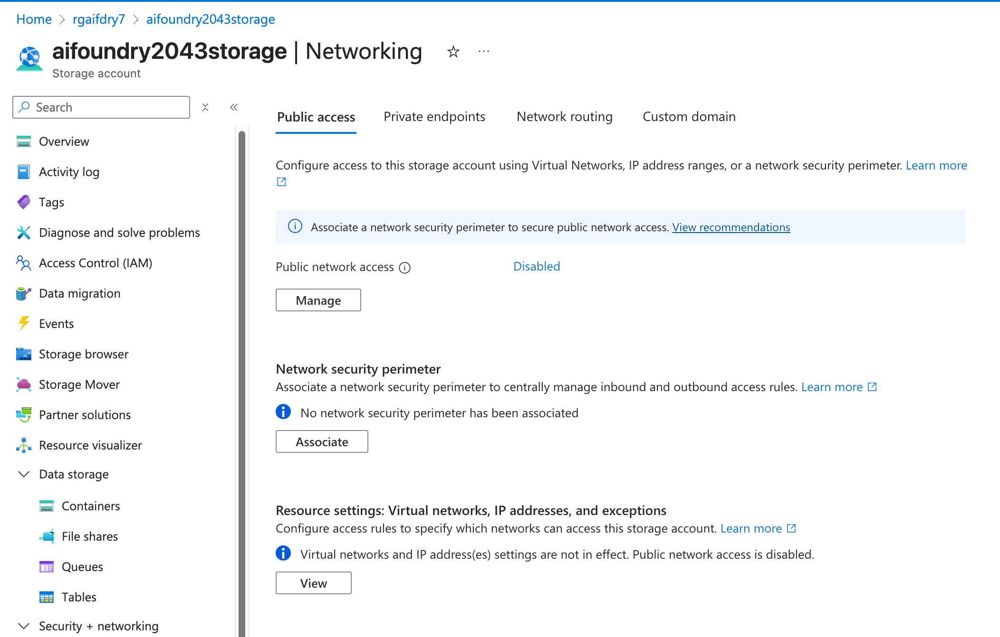
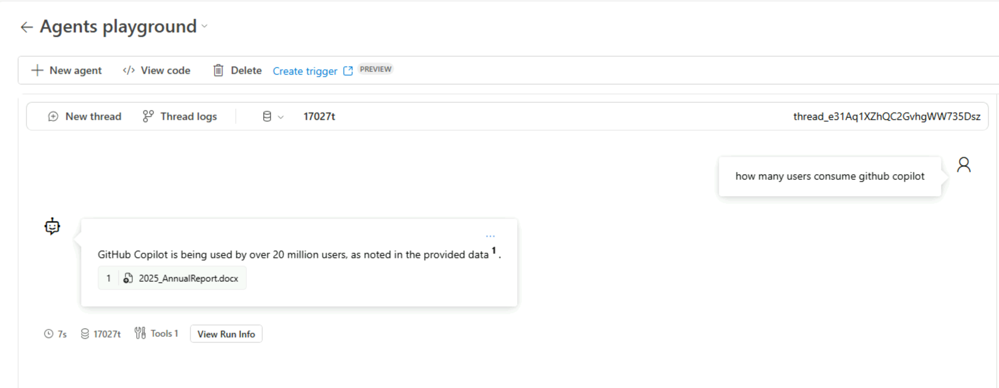

## Introduction 
Microsoft Foundry (Previously called AI Foundry) provides powerful capabilities for building and deploying AI agents and solutions. For enterprise customers, securing these deployments within their own network infrastructure is critical for compliance, governance, and integration with existing landing zones. The Bring Your Own (BYO) VNET deployment pattern enables organizations to secure and control both inbound and outbound access to Foundry Agent services while maintaining network isolation. 
In this blog post, I'm sharing lessons learned from a recent Microsoft Foundry Agent Service deployment utilising the BYO VNET pattern. This approach is particularly valuable for organizations that need to: 
- Integrate Microsoft Foundry with existing hub and spoke network architecture
- Enforce strict network security policies 
- Maintain compliance with regulatory requirements 
- Control data flow and access patterns
  
### Understanding AI Foundry Versions


It's important to note that there are multiple versions of AI Foundry in documentation. This blog focuses on **Microsoft Foundry Classic** Service. For a detailed explanation of the differences between Hub based and Projectbased Foundry experiences, refer to [this blog](https://techcommunity.microsoft.com/blog/azure-ai-foundry-blog/build-recap-new-azure-ai-foundry-resource-developer-apis-and-tools/4427241).


## Security Architecture Overview 
When deploying Microsoft Foundry using the BYO VNET approach, there are three critical security layers to configure: 

1. **Individual Resource Configuration** - Network access settings for each Azure resource 
2. **Network Security Groups (NSGs)** - Subnet level traffic filtering for the delegated Microsoft Foundry subnet 
3. **Azure Firewall Configuration** - Centralised outbound access control

## Prerequisites 
Before deploying Microsoft Foundry with BYO VNET, ensure you have: 

- An existing VNET with available address space for dedicated subnets 
- Azure Firewall or equivalent network virtual appliance 
- Appropriate Azure RBAC permissions to create resources and configure networking 
- Understanding of your organization's network architecture and security requirements
### Deployment
Foundry team has published templates for both [Bicep](https://github.com/azure-ai-foundry/foundry-samples/tree/main/infrastructure/infrastructure-setup-bicep/15-private-network-standard-agent-setup) and [Terraform](https://github.com/azure-ai-foundry/foundry-samples/tree/main/infrastructure/infrastructure-setup-terraform/15b-private-network-standard-agent-setup-byovnet) that can be used for creating Foundry deployment using customer owned VNET. This deployment template requires below resources for a successful deployment 

**1. Agent Subnet with Delegation**
- Recommended minimum size: /26 or larger depending on scale requirements
- Agent subnet delegated to Foundry with Subnet delegation using "Microsoft.App/environments" as below

**2. Private Endpoints Subnet**
- Dedicated subnet for hosting private endpoints to Microsoft Foundry resources
- No delegation required
- Recommended size: /27 or larger

### Required Private DNS Zones
Microsoft Foundry Agent Service must be able to resolve private endpoints. This can be achieved by either:
- Directly linking Private DNS zones to your VNETs, or
- Using custom DNS configuration on the VNET pointing to Azure Private DNS Resolver or other DNS resolver service

**Required DNS zones:**
- `privatelink.blob.core.windows.net`
- `privatelink.cognitiveservices.azure.com`
- `privatelink.documents.azure.com`
- `privatelink.openai.azure.com`
- `privatelink.search.windows.net`
- `privatelink.services.ai.azure.com`
- `privatelink.file.core.windows.net`
### Network Security Group Configuration 
NSG configuration is critical for controlling outbound access from the Microsoft Foundry delegated agent subnet. The following outbound rules represent the minimum required configuration:
### NSG Rules

**1. Entra ID Access (Azure Active Directory)**
- Service Tag: `AzureActiveDirectory`
- Required for identity access 
- Port: 443 (HTTPS)

**2. Container Apps Management**
- Service Tag: `AzureContainerAppsManagement`
- Required for Container Apps platform management
- Port: 443

**3. Container Registry**
- Service Tag: `AzureContainerRegistry`
- Required for pulling container images
- Port: 443

**4. Container Apps Internal Communication**
- Destination: - 100.100.0.0/17, 100.100.128.0/19,100.100.160.0/19,100.100.192.0/19
- Container Apps uses this range for internal platform communication
- Ports: Any

### Azure Firewall Configuration
Azure Firewall provides centralised control over outbound traffic from the Microsoft Foundry environment. [Azure firewall processes rules](https://learn.microsoft.com/en-us/azure/firewall/rule-processing) in the following order:  

1. **Network Rules** - Processed first
2. **Application Rules** - Processed if no network rule match

### Network Rules Configuration
Configure network rules to allow traffic to Azure service tags:
- `AzureActiveDirectory` - Port 443
- `InternalACATraffic`


**Key Configuration Note:** Create an IP Group containing [Container Apps internal IP ranges](https://learn.microsoft.com/en-us/azure/container-apps/custom-virtual-networks?tabs=workload-profiles-env#subnet-address-range-restrictions) (100.64.0.0/10, 100.100.0.0/17, 100.100.128.0/19, 100.100.160.0/19, 100.100.192.0/19) to use as source addresses in firewall rules.


### Application Rules Configuration
Application rules provide FQDN-based filtering for outbound HTTPS traffic to specific domains required by Microsoft Foundry services.

### Resource Configuration 
All Microsoft Foundry related resources should be configured with network security in mind and with disabled public access.

Microsoft Foundry resource network configuration below

Delegated subnet configuration

Cosmos DB Network configuration - Disabled Public Access

AI Search Network configuration - Disabled Public Access

Azure Storage Network configuration - Disabled Public Access 

### Foundry Agent Validation

After deployment, validate Microsoft Foundry Agent service functions correctly:

### 1. Create a New Agent

Use Microsoft Foundry Portal to create and configure a new agent. Successful agent creation indicates proper network connectivity and resource access.

### 2. Upload Knowledge Files

Test file upload functionality, which demonstrates:
- Azure Storage connectivity via private endpoint
- AI Search integration for vector database population
- Authentication through Entra ID

### 3. Test Chat Playground

Validate agent responses using the chat playground. This tests:
- End to end agent functionality
- Knowledge retrieval from vector store
- LLM endpoint connectivity (Using GPT4o in this example)

Thread logs functionality to trace requests

This is another example where we are asking a relevant questions with knowledge provided (Microsoft annual report 2025). We get expected response with reference to uploaded content.

### 4. Review Thread Logs

Use the built-in thread logs functionality to:
- Observe tool calls against the vector store
- Validate response generation
- Troubleshoot any issues with agent behavior

### Observability 

Comprehensive observability is essential for operating Microsoft Foundry in production. Enable diagnostic logging across all components to gain visibility into traffic flows and request patterns.

#### Observability - > Firewall

Having logs enabled on the firewall allows us to observe traffic flows from Microsoft Foundry delegated subnet. Looking at logs below, we can see communication from Foundry subnet, towards Microsoft Container Registry and towards Azure Container Apps endpoints.

Application Rule Logs below

Network Rule Logs below

#### Observability -> VNET Flow Logs

Below are logs from the VNET hosting agents. We can observe ACA Traffic reaching Microsoft managed endpoinst

#### Observability -> Microsoft Foundry Logs

Foundry Logs also demonstrates requests from User towards Foundry Private Endpoints and other services reaching foundry service.

#### Observability -> CosmosDB Logs

We are also able to see request logs from CosmosDB Logs showcasing request from Agent delegated Subnet.

## Conclusion

Deploying Microsoft Foundry using the Bring Your Own VNET pattern provides enterprise grade security and network control for AI agent workloads. This blog post has demonstrated a comprehensive approach to securing Microsoft Foundry deployments through three critical layers: individual resource network configuration, subnet  NSG rules, and centralised Azure Firewall policies.

### Key Takeaways

**Security in Depth**: BYO VNET pattern enables defense in depth by combining multiple security controls from resource level private endpoints to network level traffic filtering. This layered approach ensures that Microsoft Foundry deployments meet enterprise security requirements while maintaining full functionality.

**Private Endpoints Are Critical**: All Microsoft Foundry resources should be configured with disabled public network access and accessed exclusively through private endpoints. This ensures traffic remains within your virtual network and integrates seamlessly with existing Azure landing zone.

**Observability is Essential**: Comprehensive logging across Azure Firewall, VNET Flow Logs, and resource specific diagnostics provides the visibility needed to troubleshoot issues, optimize performance, and maintain security compliance. The investment in proper logging pays dividends during operations.