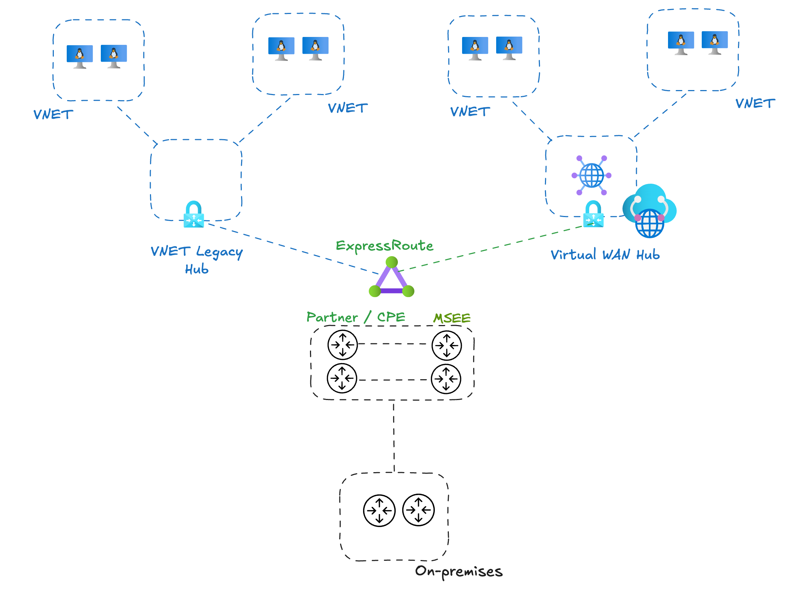
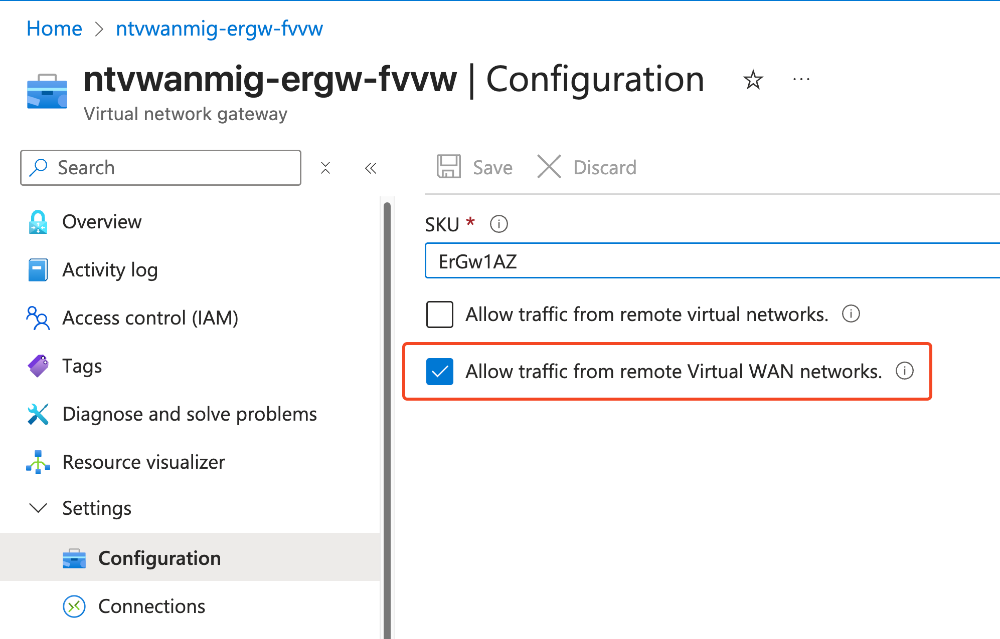
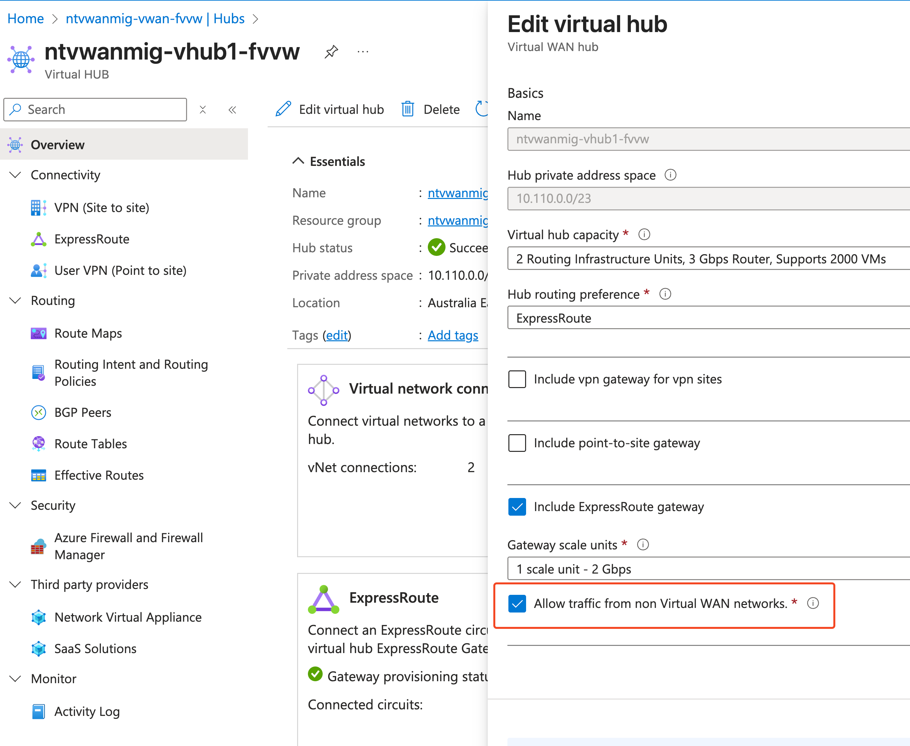
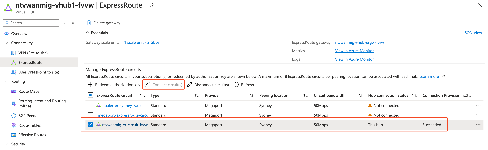
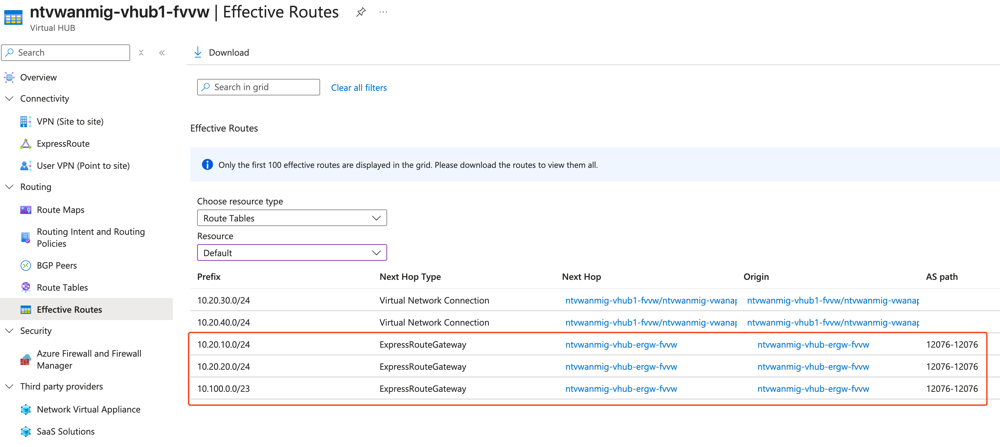
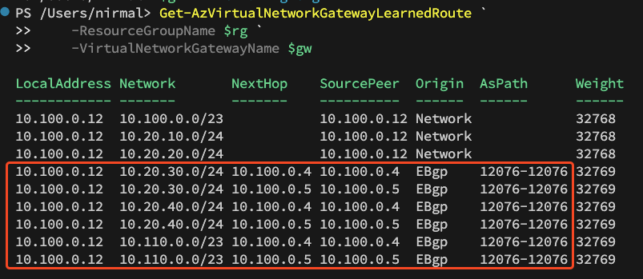
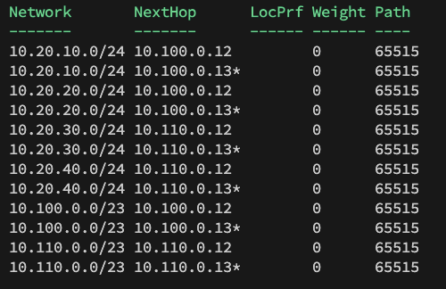
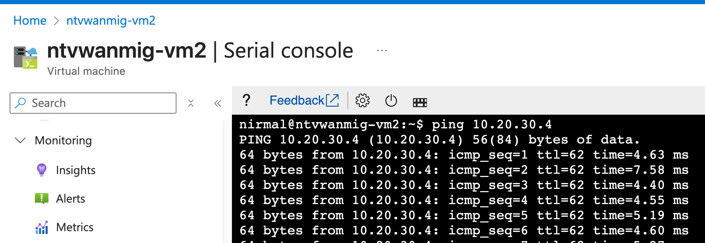

## Introduction 
Migrating from a traditional hub-and-spoke Virtual Network (VNET) architecture to Azure Virtual WAN can seem complex & challenging, but establishing coexistence between both environments during the transition makes the process smoother and reduces risk. This post walks you through the most efficient approach for maintaining connectivity during your migration.

When planning your Virtual WAN migration, you have several connectivity options to bridge your existing and new environments
- Utilise ExpressRoute Circuit 
- Utilise Site to Site VPN Connectivity using VPN Gateways
- Utilise SD-WAN Connectivity using SD-WAN NVAs 
- Utilise On-premises traffic routing 

**Recommended Approach:** If your existing environment already uses ExpressRoute, this is the most straightforward and cost-efficient coexistence strategy. However, recent Azure changes require specific configuration steps to ensure proper route propagation between environments. I have detailed below, configuration required to make this scenario work in your environment.



#### Step 01 -> Enable "Allow traffic from remote Virtual Networks" in your existing Traditional Hub Spoke ExpressRoute Gateway 
This option allows Virtual WAN routes to be propagated to existing traditional hub spoke environment. Without this, routes wont be learned and this option is not enabled by default. 


#### Step 02 -> Enable "Allow traffic from non Virtual WAN networks" in your Virtual WAN Hub 
This options allows routes learned by tranditional hub spoke environment to be propagated to Virtual WAN Hubs. This option is also disabled by default. 


#### Step 03 -> Connect existing ExpressRoute Circuit to Virtual WAN Hub 
This establishment allows routes to be exchanged between existing hub spoke environment and new virtual wan environment 


Once we have established connectivity, next we can validate route exchange between existing and new environments 

#### Step 04 - Verify Virtual WAN effective Routes 
Effective routes show us learned routes and we can see routes learned via 12076 AS Path. These are routes learned from remote traditional hub spoke environment 



#### Step 05 - Verify Traditional Hub Spoke Environment 
To verify traditional Hub Spoke environment, we will utilise powershell and list learned routes on the ExpressRoute Gateway 
```powershell 
$rg = 'ntvwanmig-fvvw'
$gw = 'ntvwanmig-ergw-fvvw'

Get-AzVirtualNetworkGatewayLearnedRoute `
-ResourceGroupName $rg `
-VirtualNetworkGatewayName $gw
```

Below is the output from traditional Hub Spoke ExpressRoute Gateway. This is demonstrating gateway learning routes from Virtual WAN environment via existing ExpressRoute Circuit and using AS Path 12076. 


We can also verify routes learned by the ExpressRoute Circuit using below command 
```powershell 
$rg = 'ntvwanmig-fvvw'
$erc = 'ntvwanmig-er-circuit-fvvw'

Get-AzExpressRouteCircuitRouteTable -ResourceGroupName $rg `
-ExpressRouteCircuitName $erc `
-PeeringType "AzurePrivatePeering" `
-DevicePath "Primary"
```

Below output confirms routes learned via traditional Hub Spoke ER Gateway and Virtual WAN Hub ER gateway. Note that these routes are all learned via AS 65515 which is assigned to each of the gateways in vWAN and Hub Spoken environment. 


VMs from existing environment can now reach new Virtual WAN environment 


I have also created a video demonstrating this scenario below



## Key Takeaways
- **Planning is crucial:** Understand your connectivity options before beginning migration
- **Configuration order matters:** Follow the steps in sequence for successful coexistence
- **Verification is essential:** Use both Azure portal and PowerShell to confirm proper route propagation
- **ExpressRoute is optimal:** If already in use, ExpressRoute provides the most cost-effective coexistence solution

## Conclusion
Establishing coexistence between traditional hub-and-spoke and Virtual WAN environments doesn't have to be complex. By following these configuration steps and properly verifying route propagation, you can ensure smooth connectivity during your migration process. This approach minimises downtime and reduces the risk associated with large-scale network changes.